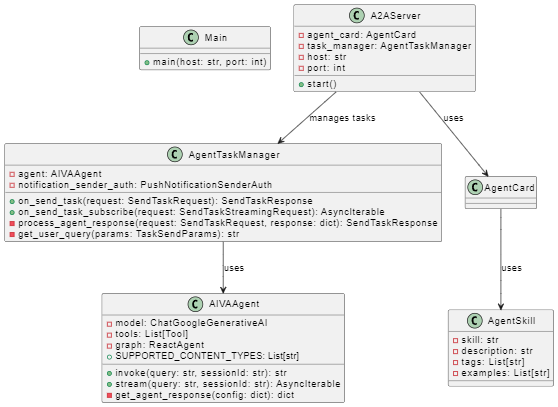

# A2A-AIVA

A2A interface to AIVA AI Assistant.

The Aiva A2A server has an Agent card describing the agent and its skills, and a TaskManager that processes any tasks issued to the A2AServer. The TaskManager uses the AIVA Agent to actually process the tasks. See the diagram below.

The code for the **AIVAAgent**, the **TaskManager** and the **Main** function that sets-up the A2A server are in `agents\langgraph`. The **A2AServer**, **AgentCard** and **AgentSkill** classes are standard classes and are in the 'common' folder.